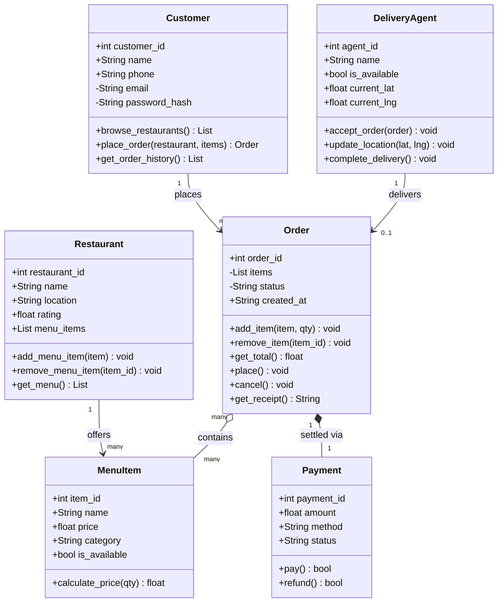

# FoodFlow — Class Diagram

```mermaid
classDiagram
    class Customer {
        +int customer_id
        +String name
        +String phone
        -String email
        -String password_hash
        +browse_restaurants() List
        +place_order(restaurant, items) Order
        +get_order_history() List
    }

    class Restaurant {
        +int restaurant_id
        +String name
        +String location
        +float rating
        +List menu_items
        +add_menu_item(item) void
        +remove_menu_item(item_id) void
        +get_menu() List
    }

    class MenuItem {
        +int item_id
        +String name
        +float price
        +String category
        +bool is_available
        +calculate_price(qty) float
    }

    class Order {
        +int order_id
        -List items
        -String status
        +String created_at
        +add_item(item, qty) void
        +remove_item(item_id) void
        +get_total() float
        +place() void
        +cancel() void
        +get_receipt() String
    }

    class Payment {
        +int payment_id
        +float amount
        +String method
        +String status
        +pay() bool
        +refund() bool
    }

    class DeliveryAgent {
        +int agent_id
        +String name
        +bool is_available
        +float current_lat
        +float current_lng
        +accept_order(order) void
        +update_location(lat, lng) void
        +complete_delivery() void
    }

    Customer "1" --> "many" Order : places
    Restaurant "1" --> "many" MenuItem : offers
    Order "many" o-- "many" MenuItem : contains
    Order "1" *-- "1" Payment : settled via
    DeliveryAgent "1" --> "0..1" Order : delivers
```