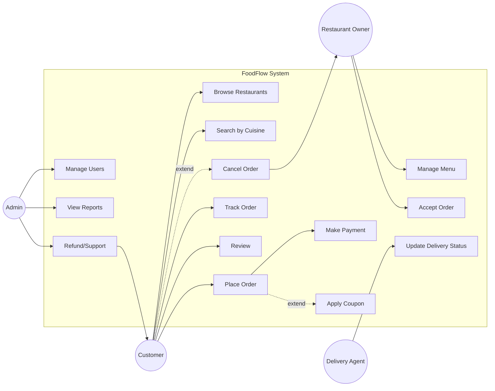

# FoodFlow — Use Case Diagram

```mermaid
%% graph means we are drawing a diagram.
%% LR means the diagram is drawn Left to Right.
%% The double brackets (( )) make them appear as circles in the diagram.
%% Each square bracket [ ] represents a Use Case, A use case is simply something the user can do
graph LR
    Customer((Customer))
    RestOwner((Restaurant Owner))
    Agent((Delivery Agent))
    Admin((Admin))
    %% subgraph FoodFlow System gives a title to the system, and all the use cases are listed inside it.
    %% --> indicates a relationship between the actor and the use case or between two use cases.
    %%  -.->|extend| indicates an extension relationship between two use cases. 
    subgraph FoodFlow System
        UC1[Browse Restaurants]
        UC2[Search by Cuisine]
        UC3[Place Order]
        UC4[Track Order]
        UC5[Make Payment]
        UC6[Apply Coupon]
        UC7[Manage Menu]
        UC8[Accept Order]
        UC9[Update Delivery Status]
        UC10[Manage Users]
        UC11[View Reports]
        UC12[Review]
        UC13[Cancel Order]
        UC14[Refund/Support]
    end

    Customer --> UC1
    Customer --> UC2
    Customer --> UC3
    Customer --> UC4
    Customer --> UC12
    Customer -.->|extend| UC13
    UC3 --> UC5  
    UC3 -.->|extend| UC6

    RestOwner --> UC7
    RestOwner --> UC8
    UC13 --> RestOwner

    Agent --> UC9

    Admin --> UC10
    Admin --> UC11
    Admin --> UC14 --> Customer
```