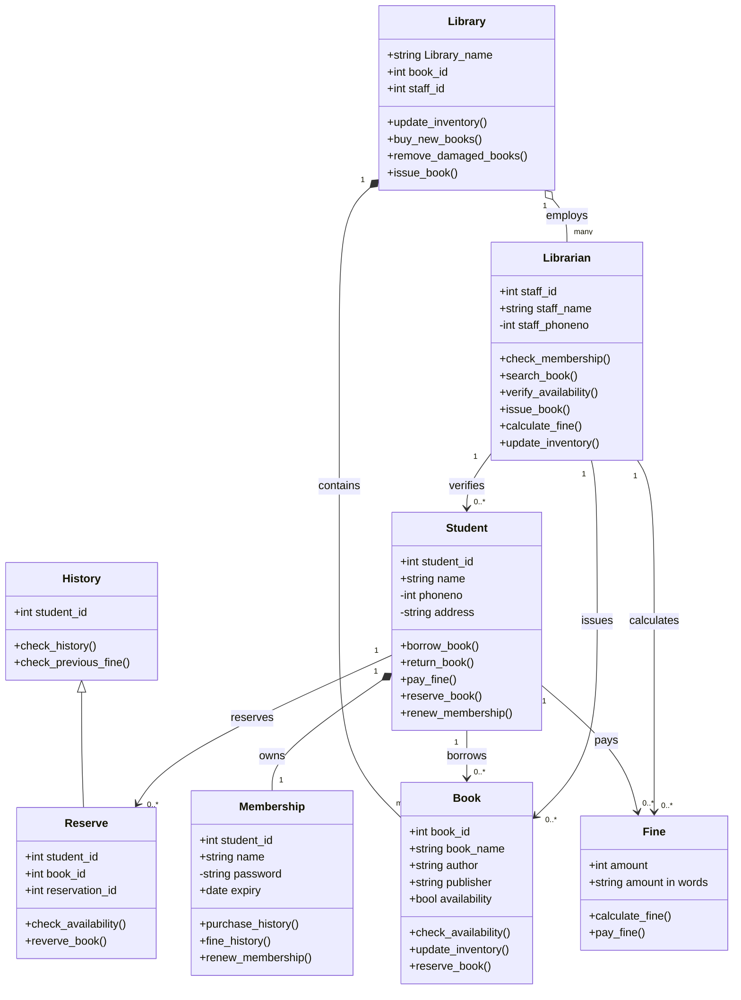

```mermaid
classDiagram
    class Librarian{
        +int staff_id
        +string staff_name
        -int staff_phoneno
        +check_membership()
        +search_book()
        +verify_availability()
        +issue_book()
        +calculate_fine()
        +update_inventory()
    }
    class Student{
        +int student_id
        +string name
        -int phoneno
        -string address
        +borrow_book()
        +return_book()
        +pay_fine()
        +reserve_book()
        +renew_membership()
    }
    class Book{
        +int book_id
        +string book_name
        +string author
        +string publisher
        +bool availability
        +check_availability()
        +update_inventory()
        +reserve_book()
    }
    class Fine{
        +int amount
        +string amount in words
        +calculate_fine()
        +pay_fine()
    }
    class Library{
        +string Library_name
        +int book_id
        +int staff_id
        +update_inventory()
        +buy_new_books()
        +remove_damaged_books()
        +issue_book()
    }
    class Membership{
        +int student_id
        +string name
        -string password
        +date expiry
        +purchase_history()
        +fine_history()
        +renew_membership()
    }
    class History{
        +int student_id
        +check_history()
        +check_previous_fine()
    }
    class Reserve{
        +int student_id
        +int book_id
        +int reservation_id
        +check_availability()
        +reverve_book()
    }
     
     Librarian "1" --> "0..*" Student : verifies
     Librarian "1" --> "0..*" Book : issues
     Librarian "1" --> "0..*" Fine : calculates

     Student "1" --> "0..*" Book : borrows
     Student "1" --> "0..*" Reserve : reserves
     Student "1" --> "0..*" Fine : pays
     Library "1" o-- "many" Librarian : employs
     Library "1" *-- "many" Book : contains
     Student "1" *-- "1"Membership : owns
     History <|--  Reserve  
```